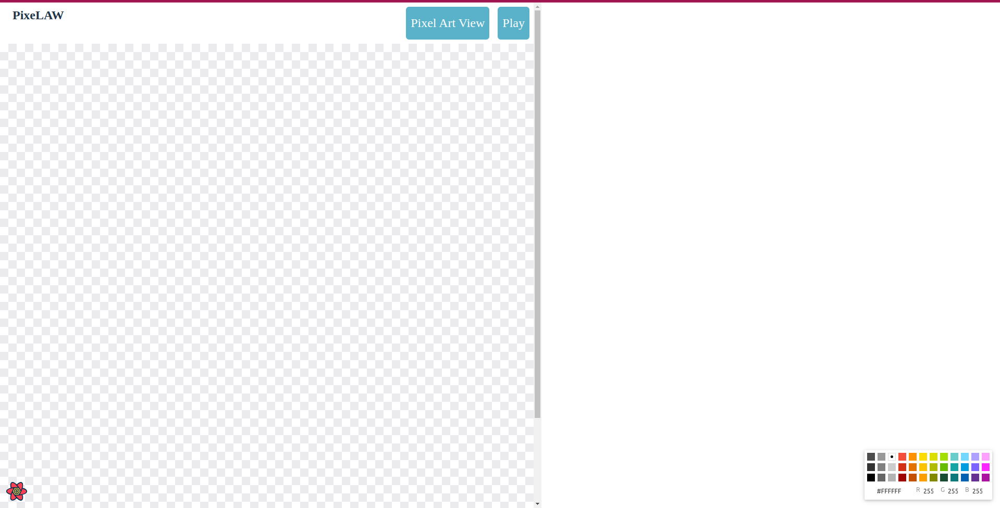
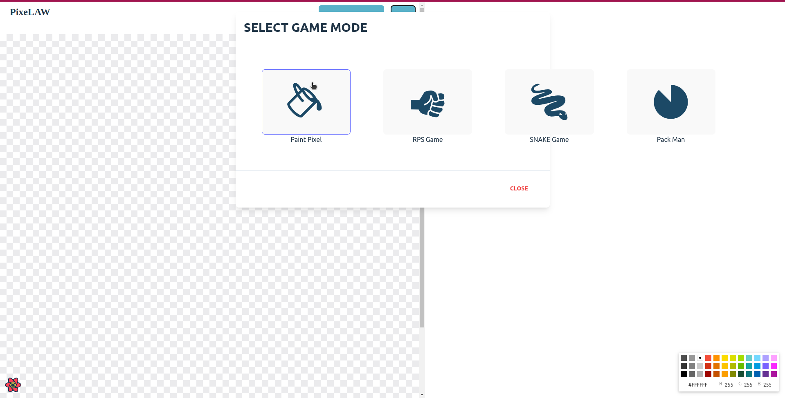

# PixeLAW Game
A game built on top of Dojo.

## Prerequisites

-   Rust - install [here](https://www.rust-lang.org/tools/install)
-   Cairo language server - install [here](https://book.dojoengine.org/development/setup.html#3-setup-cairo-vscode-extension)
-   Dojo - install [here](https://book.dojoengine.org/getting-started/installation.html)
-   Scarb - install [here](https://docs.swmansion.com/scarb/download)

## Developing Locally

### Step 1: Build the contracts

```shell
make build
```

This command compiles your project and prepares it for execution.

### Step 2: Start Katana RPC

[Katana RPC](https://book.dojoengine.org/framework/katana/overview.html) is the communication layer for your Dojo World. It allows different components of your world to communicate with each other. To start Katana RPC, use the following command:

```shell
katana
```

### Step 3: Migrate (Deploy) the World

This command, deploys your world to Katana!

```shell
cd contracts
scarb run deploy
```

### Step 4: Run torii

[Torii](https://book.dojoengine.org/framework/torii/overview.html) serves as a comprehensive indexing and networking layer for dojo worlds. It systematically organizes the state of dojo worlds, facilitating efficient querying for clients.

````shell
cd contracts
torii --manifest target/dev/manifest.json --world 0x26bada1b980d220e0842659711c8891a432ef4c1d9e35c0d973414e88512390
````

### Step 5: Get the React frontend ready

```shell
make prep_web
cd web
yarn
```

### Step 6: Run the frontend locally

```shell
cd web
yarn dev
```

### Step 7: Run the queue bot
````shell
cd bots
yarn dev
````

#### NOTE
To change accounts, add an account query to the frontend url. For example: http://localhost:5173/?account=1. Add
as many accounts as desired by following the pattern set in the env.example.

The following would be example players:
````console
# for player 1
http://localhost:5173/?account=1
# for player 2
http://localhost:5173/?account=2
````

Also, before starting the game, hit the play button, and then hit the paint button.



## Project Structure 
This is an overview of the most important folders/files:
- `Makefile` : A collection of helpful commands, mainly for Dojo
- `contracts` : The Dojo Cairo smart contract code
  - `src/components.cairo` : Dojo component definitions
  - `src/systems.cairo` : Dojo component definitions
  - `src/Scarb.toml` : The scarb config file used for katana
- `web` : A [Vite](https://vitejs.dev/) React project 
  - `.env` : (copied from env.example) Contains the hardcoded developer addresses used for Dojo
  - `src/dojo/contractComponents.ts` : Client-side definitions of the components
  - `src/dojo/createClientComponents.ts` : Client-side setup of the components
  - `src/dojo/createSystemCalls.ts` : Client-side definitions of the systems

## Typical development activities
### Add a DOJO system
- Edit `src/systems.cairo` 
- Edit `src/dojo/createSystemCalls.ts`
### Add a DOJO component
- Edit `src/components.cairo`
- Edit `src/dojo/contractComponents.ts`
- Edit `src/dojo/createClientComponents.ts`
### Redeploy to Katana
- Restart Katana
- Redeploy the contracts with `cd contracts && scarb run deploy`

## Troubleshooting / Tricks
### When using vscode, the cairo language server panics with `thread 'main' panicked at 'internal error: entered unreachable code: `
Resolution: None, this is a know issue, can ignore

### When deploying/migrating, consistent exceptions even though the contract compiles.
Resolution: Delete the `contracts/target` dir

### How do I use different accounts while testing?
Register 2 accounts (example from https://github.com/coostendorp/dojo-rps): 
```
let player1 = starknet::contract_address_const::<0x1337>();
let player2 = starknet::contract_address_const::<0x1338>();
```
And then switch accounts like this:
```
starknet::testing::set_contract_address(player1);
```
